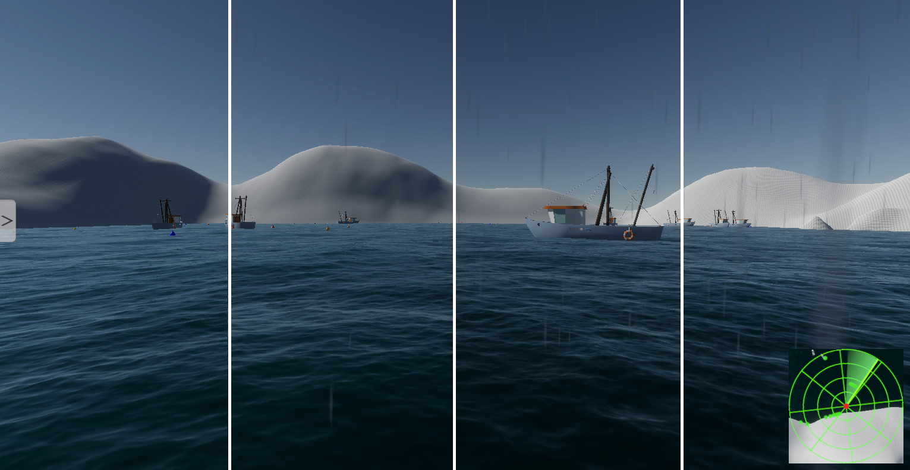

# ASV Unity Simulator

# Setup Instructions

1. Download the project and extract if needed
2. Open the project in Unity. We used editor version `2022.3.12f1`, but later versions of Unity may work as well.
3. If you want to use ROS and are on Linux, 
4. Current demo scene is located at `Assets/Scenes/3DAttributes.unity`

# Features

* Fully customizable 3D environments
* Generate terrain from elevation images

* Accurate water, wind, and rain simulation
* Simulation of maritime traffic

* Accurate simulation of multiple sensors (LiDAR, radar, IMU, GPS)

* Ground truth perception packages (Color, Segmentation, Depth, Normal, Bounding Boxes, etc)
* Data recording
* Extensive and user friendly settings UI

# Optional keyboard controls for the primary robot are:
* R and F - Forward and Backward left propeller
* U and J - Forward and Backward right propeller
* Hit R and U simultaneously to move forward
* Hit F and J simultaneously to move back
* Hit R and J together, or F and Y together, or any key by itself to rotate
* Hit spacebar to save a screenshot (.png format) in the project directory

# Limitations
* Terrain and buildings will only be as high resolution as what has been imported into the project. As you can see in the following pictures, even the same location can look completely different depending on the data you use to create your terrain models.
 
* At this time, the "ocean" will always be at a height of 0 meters. This can result in pockets of water in land if the land is below sea level.

* If the water that is supposed to be simulated is not at sea level (e.g. a lake in a mountain range like we have here in New Hampshire), you will need to manually set the min and max height of the terrain relative to the water's elevation.
* Alternatively, it's possible to [manually create a custom river/lake with unique heights and shapes within Unity](https://blog.unity.com/engine-platform/new-hdrp-water-system-in-2022-lts-and-2023-1) if the user wants to take the time to fully customize everything.
