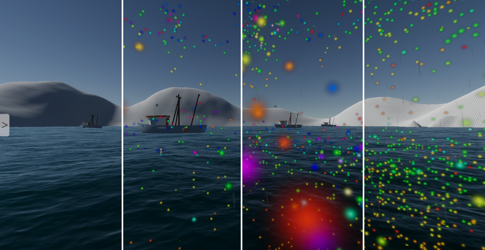

# ASV Unity Simulator

# Setup Instructions

1. Make sure Git has been installed beforehand. You may need to restart your computer.
2. Download the project and extract if needed
3. Open the project in Unity. We used editor version `2022.3.12f1`, but later versions of Unity may work as well.
4. If you want to use ROS and are on Linux, 
5. Current demo scene is located at `Assets/Scenes/3DAttributes.unity`

# Features

* Fully customizable 3D environments
* Generate terrain from elevation images

* Accurate water, wind, and rain simulation
* Simulation of maritime traffic

* Accurate simulation of multiple sensors (LiDAR, radar, IMU, GPS)

* Ground truth perception packages (Color, Segmentation, Depth, Normal, Bounding Boxes, etc)
* Data recording
* Extensive and user friendly settings UI

# Optional keyboard controls for the primary robot are:
* R and F - Forward and Backward left propeller
* U and J - Forward and Backward right propeller
* Hit R and U simultaneously to move forward
* Hit F and J simultaneously to move back
* Hit R and J together, or F and Y together, or any key by itself to rotate
* Hit spacebar to save a screenshot (.png format) in the project directory
